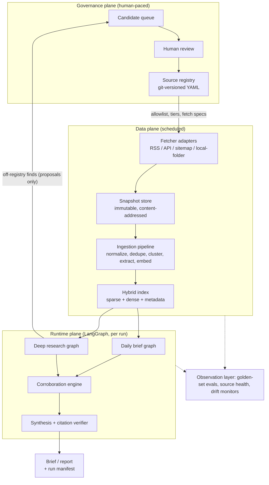
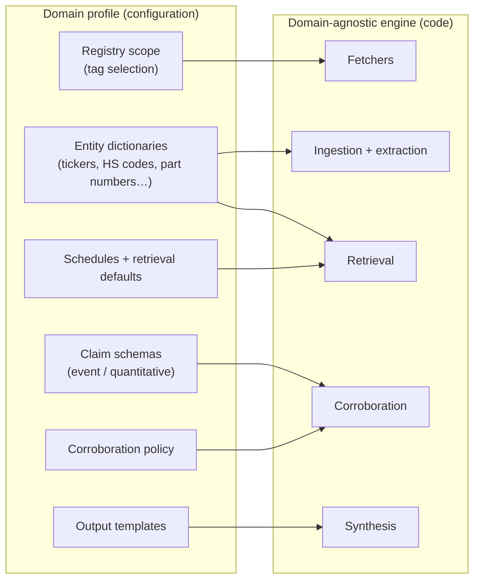
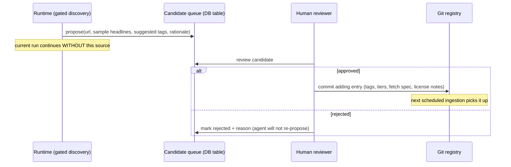
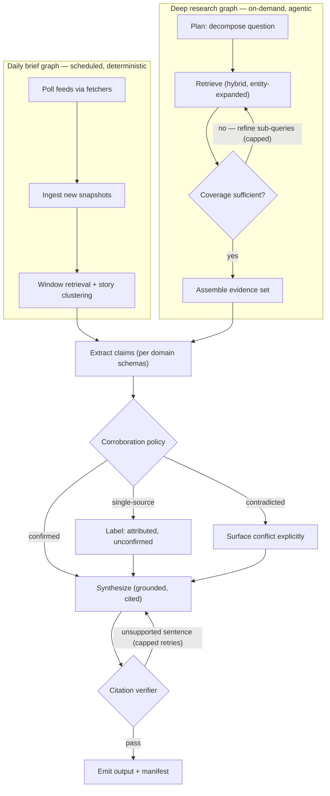
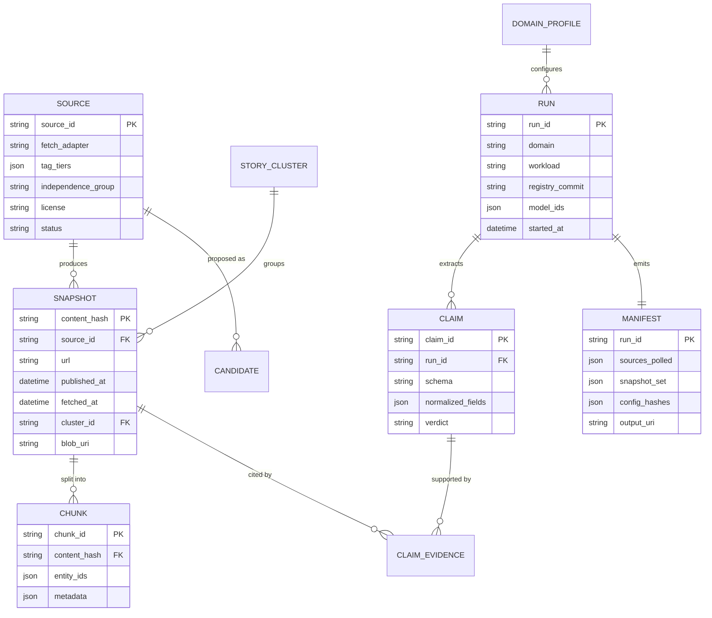
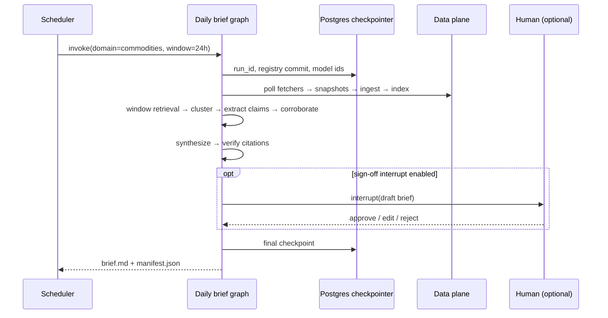

# Argus — Solution Architecture Document

**Controlled-Source Research Agent for News Monitoring and Deep Research**

| | |
|---|---|
| **Status** | Draft v0.3 — for review (v0.2: LLM stack pinned to Azure OpenAI via LangChain; v0.3: LlamaIndex removed — data plane is LangGraph/LangChain-native) |
| **Date** | 2026-07-05 |
| **Working name** | Argus (placeholder; rename freely) |
| **Audience** | Implementers. Code is generated in adherence to this document. |

---

## Table of contents

1. [Introduction](#1-introduction)
2. [Problem statement and design goals](#2-problem-statement-and-design-goals)
3. [Architectural decisions](#3-architectural-decisions)
4. [System overview](#4-system-overview)
5. [Domain genericity model](#5-domain-genericity-model)
6. [Governance plane](#6-governance-plane)
7. [Data plane](#7-data-plane)
8. [Runtime plane](#8-runtime-plane)
9. [Data model](#9-data-model)
10. [Technology stack](#10-technology-stack)
11. [Key workflows](#11-key-workflows)
12. [Non-functional requirements](#12-non-functional-requirements)
13. [Repository layout](#13-repository-layout)
14. [Risks and open questions](#14-risks-and-open-questions)
15. [Roadmap](#15-roadmap)
16. [Appendix A — Glossary](#appendix-a--glossary)

---

## 1. Introduction

### 1.1 Purpose

This document specifies the architecture of Argus, a research agent that produces
**scheduled monitoring briefs** and **on-demand deep research reports** from a
combination of web sources and locally curated corpora. It is the authoritative
reference for implementation: module boundaries, data contracts, and policies
defined here are binding unless amended by a revision of this document.

### 1.2 Scope

In scope: source governance, ingestion, storage, indexing, agent orchestration,
claim corroboration, cited synthesis, reproducibility, and the configuration
model that adapts the system to arbitrary research domains (general news,
finance, commodities, automotive parts, agriculture, and others not yet named).

Out of scope: end-user UI beyond a CLI and file outputs, multi-tenant serving,
real-time (sub-minute) alerting. These are listed as extension points in §14.

### 1.3 Reading guide

§2–§4 explain *why* the architecture has its shape. §5 defines the genericity
mechanism (domain profiles) that every other section depends on. §6–§9 specify
the three planes and the data model. §10–§15 cover stack, workflows,
non-functionals, layout, and sequencing.

---

## 2. Problem statement and design goals

### 2.1 Problem statement

Off-the-shelf web research agents delegate **source selection** to a search
engine's ranking algorithm. Ranking optimizes relevance and freshness signals,
not authority, and it re-ranks nondeterministically between runs. The observed
symptom: a daily monitoring query returns Bloomberg one day and an obscure
regional outlet the next, with no way to constrain, audit, or reproduce the
choice. Additionally, such agents cannot incorporate a manually compiled local
corpus as a first-class, trusted source.

### 2.2 Design goals

| ID | Goal | Meaning |
|----|------|---------|
| G1 | **Source control** | Only sources on a human-approved, tiered allowlist may ever be cited. Source selection is a governance decision, not a runtime one. |
| G2 | **Determinism** | Given the same registry version, snapshot set, and configuration, a run is replayable and produces auditable, stable citations. |
| G3 | **Verifiability** | Every claim in an output traces to one or more immutable, content-hashed snapshots. Corroboration status is explicit. |
| G4 | **Hybrid corpora** | Web sources and local corpora flow through one ingestion path, one index, and one retrieval API. |
| G5 | **Domain genericity** | The engine contains zero domain-specific code. Everything that varies between "general news" and "automotive parts" is configuration (a *domain profile*, §5). |
| G6 | **Auditability** | Every run emits a manifest sufficient to answer: which sources were consulted, what they said, and why each claim was accepted, attributed, or flagged. |
| G7 | **Human governance** | New sources, registry changes, and (optionally) outbound briefs pass through human review checkpoints. |

### 2.3 Non-goals

- Open-web crawling or citing off-registry sources under any circumstance.
- Determining "objective truth"; the system reports corroboration status
  against *your* trust policy, which is a different and achievable claim.
- Trading signals, investment advice, or any decision automation on top of the
  research output.
- Bypassing paywalls or source terms of service (§12.4).

---

## 3. Architectural decisions

Summary of binding decisions. Each is elaborated in the referenced section.

| ID | Decision | Rationale | Ref |
|----|----------|-----------|-----|
| AD-1 | **Pull-first ingestion**: registered feeds/APIs/sitemaps are the primary channel; web search exists only as *gated discovery* whose results can never be cited directly. | Removes search-engine ranking from the trust path entirely; the source set is constant by construction. | §7.1 |
| AD-2 | **Registry as versioned configuration** in git, changed via reviewed commits. | Trust policy becomes diffable, reviewable, and attributable — the control lever G1 demands. | §6.1 |
| AD-3 | **Immutable, content-addressed snapshot store** for all raw fetched material. | News articles are silently edited post-publication; citations must point at frozen bytes. Enables replay (G2). | §7.2 |
| AD-4 | **Single hybrid index** (sparse + dense + metadata) over web and local documents sharing one normalized schema. | G4; sparse retrieval is essential for exact entities (tickers, part numbers, vessel names). | §7.4 |
| AD-5 | **Domain behavior is configuration, not code** (domain profiles + plugin adapters). | G5; adding a niche domain must never require touching engine modules. | §5 |
| AD-6 | **LangGraph runtime with a Postgres checkpointer**; the checkpoint history *is* the run manifest backbone. | Durable execution, replay, and human-in-the-loop interrupts are first-class in LangGraph 1.x rather than custom infrastructure. | §8 |
| AD-7 | **Corroboration as an explicit, per-domain policy engine** operating on extracted claims, with syndication-aware independence. | G3; "two sources" must mean two *independent* sources, and numeric claims need tolerance matching. | §8.4 |
| AD-8 | **Grounded synthesis with a citation verifier loop**: the writer may only use retrieved snippets; a verifier rejects unsupported sentences. | Closes the last gap between retrieval and output (G3). | §8.5 |
| AD-9 | **One framework family: LangGraph orchestrates everything — including ingestion, which is itself a small LangGraph graph.** The data plane is thin custom Python on LangChain components (`langchain-text-splitters` for chunking, Azure embeddings via `langchain-openai`) plus `qdrant-client` directly. No LlamaIndex dependency. | Enforced stack preference: one ecosystem to learn, operate, and upgrade. The capabilities LlamaIndex would have provided are covered natively — ingestion idempotency by the snapshot store's content hashes + `extraction_status`, dedup by content addressing, hybrid retrieval by Qdrant's query API. | §7, §8 |
| AD-10 | **All LLM calls go through LangChain's Azure OpenAI integration** (`AzureChatOpenAI` / `AzureOpenAIEmbeddings` from `langchain-openai`), constructed in a single factory module; Azure deployments pinned per run; temperature 0 for extraction/verification steps. | Enforced stack preference. The single factory seam keeps the engine testable and swappable while standardizing on Azure OpenAI. Determinism (G2). | §10 |

---

## 4. System overview

The system is organized into three planes plus an observation layer. The
governance plane changes slowly and only through humans; the data plane runs on
schedules; the runtime plane executes per-run graphs.



Two invariants hold everywhere:

1. **Nothing off-registry is ever fetched for evidence.** Discovery search may
   *observe* the open web, but its findings can only become candidate-queue
   proposals — never snapshots, never citations.
2. **Trust policy executes in exactly one place** (the corroboration engine),
   shared by both workloads, configured per domain.

---

## 5. Domain genericity model

This is the load-bearing abstraction for goal G5. The engine is a fixed set of
domain-agnostic capabilities; a **domain profile** is a configuration bundle
that specializes those capabilities for one research domain. "Hormuz crisis
monitoring", "EU used-car parts pricing", and "monsoon impact on Indian pulses"
are each *just a profile* — same engine, same code.



### 5.1 Domain profile specification

A profile is a directory under `domains/` containing a `profile.yaml` plus its
referenced assets (dictionaries, templates). Illustrative example:

```yaml
# domains/commodities/profile.yaml
domain: commodities
description: Global commodities markets — energy, metals, softs, freight.

registry_scope:
  include_tags: [commodities, energy, shipping, macro]
  min_tier: 3                 # ignore anything below Tier 3 for this domain

entities:
  dictionaries:
    - path: entities/commodity_symbols.csv     # LME/ICE/CME codes
    - path: entities/ports_and_chokepoints.csv
  # Dictionaries drive metadata tagging at ingestion AND sparse-query
  # expansion at retrieval. They are plain CSVs: surface_form, canonical_id, type.

claims:
  schemas: [event, quantitative]
  quantitative:
    unit_normalization: true          # bbl vs tonne, USD vs EUR, etc.
    tolerance:
      relative: 0.005                 # values within 0.5% corroborate each other

corroboration:
  event:        { min_sources: 2, min_tier1: 1, independence: story_cluster }
  quantitative: { min_sources: 2, min_tier1: 1, match: [entity, metric, as_of_window],
                  value_tolerance: inherit }
  fallback: attribute                 # below threshold → publish as attributed, unconfirmed

retrieval:
  brief_window_hours: 24
  top_k: 24
  rerank: true

output:
  brief_template:  templates/brief.md.j2
  report_template: templates/report.md.j2

schedule:
  brief_cron: "30 05 * * *"
```

### 5.2 What varies per domain, and how

| Concern | Mechanism | Example across domains |
|---------|-----------|------------------------|
| Which sources | `registry_scope` selects registry entries by tag; tiers are **per-tag** (§6.1), because a source authoritative in one domain may be marginal in another. | Reuters: Tier 1 for general news and commodities; Tier 2 for automotive parts. A parts-industry trade journal: Tier 1 for automotive, absent elsewhere. |
| Vocabulary | Entity dictionaries: CSVs of surface forms → canonical IDs, applied as ingestion metadata extractors and retrieval query expanders. | Tickers and ISINs (finance); HS codes and OEM part numbers (auto parts); crop varieties and mandi names (agriculture); vessel names and chokepoints (Hormuz). |
| What counts as a claim | `claims.schemas` enables extraction schemas. `event` claims are qualitative (actor, action, object, time). `quantitative` claims are normalized tuples *(entity, metric, value, unit, as-of)*. | A price print, a tariff rate, and a rainfall figure are all quantitative claims corroborated by tolerance matching, not string matching. |
| Trust policy | Corroboration thresholds, tier requirements, independence rule, tolerance, and fallback behavior. | Niche domains with thin coverage may set `min_sources: 1` for Tier 1 trade press but keep `fallback: attribute` so single-source items are always labeled. |
| Cadence and shape | Schedules, recency windows, output templates (Jinja2). | Daily geopolitical brief vs. weekly agriculture digest. |

### 5.3 Plugin points (code extensions, engine untouched)

Some domains need custom *adapters* rather than configuration — e.g. a
structured government or exchange data API. These implement narrow interfaces
and are registered by name; profiles reference them:

| Interface | Contract | Examples |
|-----------|----------|----------|
| `Fetcher` | `fetch(source_spec, since) -> list[RawItem]` | `rss`, `sitemap`, `http_api` (generic JSON mapper), `local_folder`, plus bespoke ones (`usda_reports`, `eia_series`). |
| `Extractor` | `extract(snapshot) -> Metadata` | Dictionary tagger (built-in), table extractor for statistical releases. |
| `ClaimSchema` | Pydantic model + extraction prompt fragment | `event`, `quantitative`; a domain may add `regulatory_action`. |

Adding the agriculture domain must require: one profile directory, possibly one
`Fetcher` adapter, zero engine changes. This is an acceptance criterion.

---

## 6. Governance plane

### 6.1 Source registry

A git-versioned YAML file (or directory of files) validated by Pydantic models
at load time. It is the *only* place trust is assigned. Illustrative entry:

```yaml
# registry/sources.yaml
- id: reuters
  name: Reuters
  homepage: https://www.reuters.com
  language: en
  fetch:
    adapter: rss
    endpoints:
      - https://www.reuters.com/arc/outboundfeeds/rss/?outputType=xml
  license: "Headlines + summaries via public RSS. Full text requires agreement — see notes."
  tags:                       # tier is assigned PER TAG (see §5.2)
    general_news:  { tier: 1 }
    commodities:   { tier: 1 }
    automotive:    { tier: 2 }
  independence_group: reuters   # syndication family (§8.4)
  status: active                # active | paused | retired
  added: 2026-07-05
  notes: "Wire service; expect heavy syndication of its copy elsewhere."

- id: my_local_corpus
  name: Local curated corpus
  fetch:
    adapter: local_folder
    endpoints: [ "corpora/hormuz/" ]
  tags:
    general_news: { tier: 1 }
  independence_group: local
  status: active
```

Registry rules:

- **Tiers**: 1 = primary/wire/official (citable as confirming evidence);
  2 = reputable editorial; 3 = supplementary context (may inform, may be
  quoted as attributed, never sufficient alone to confirm). Tiers are per-tag.
- **Every change is a reviewed git commit.** The registry commit hash is
  recorded in every run manifest, so any historical output can be read against
  the exact trust policy in force at the time.
- The **local corpus is just another source** with a `local_folder` adapter and
  a tier you assign — usually Tier 1. No special-casing downstream.
- `license` is a mandatory human-readable field; fetcher adapters must respect
  it and robots.txt (§12.4). Paywalled outlets enter via licensed APIs or
  headline-level feeds, never scraping workarounds.

### 6.2 Source onboarding and the candidate queue

The runtime may *propose* sources it encountered during gated discovery, with
evidence of why they seemed valuable. Proposals wait for a human; runs proceed
without them.



The same interrupt mechanism (§8.1) can optionally gate outbound daily briefs
for editorial sign-off before they are written to their destination.

---

## 7. Data plane

### 7.1 Fetcher layer (pull-first)

For every `active` registry entry in scope, the scheduler invokes its adapter
with a `since` watermark. Adapters are deliberately dumb: fetch, don't judge.
Output is a stream of `RawItem`s (bytes + declared metadata). Gated discovery
search is *not* a fetcher: it runs in the runtime plane, is scoped/filtered
against the registry, and its off-registry results terminate at the candidate
queue (invariant 1, §4).

Operational requirements: per-source rate limits and backoff, conditional GETs
(ETag/Last-Modified), failure isolation (one broken feed never blocks a run),
and a per-source health record consumed by the observation layer.

### 7.2 Snapshot store (immutable, content-addressed)

Every fetched item is frozen before any processing:

- **Blob**: raw bytes at `snapshots/<sha256[0:2]>/<sha256>` on disk or object
  storage. Written once, never mutated.
- **Row** (Postgres `snapshots`): content hash (PK), source_id, canonical URL,
  published_at (declared), fetched_at (observed), extraction status,
  story_cluster_id (§7.3), license flags.

Citations everywhere in the system reference **content hashes, not URLs**. If a
publisher edits an article, the re-fetch produces a *new* snapshot; both
versions remain, and the manifest disambiguates which one a claim used.

### 7.3 Ingestion pipeline

Implemented as a small linear LangGraph `StateGraph` — the same runtime
conventions as §8.1, so one orchestration model covers the whole system.
Idempotency is native to our storage design rather than borrowed from a
framework: only snapshots with `extraction_status = 'pending'` enter the
graph, chunk IDs are deterministic (`<content_hash>:<n>`) so re-upserts
overwrite instead of duplicating, and a terminal status (`done` / `failed` /
`unsupported`) closes the loop across daily re-polls. Stages, in order:

1. **Extraction** — HTML → clean text (trafilatura); PDF text layers via
   pypdf (scanned/image-only PDFs surface as `empty` in ingest stats — see Q3);
   structured adapters emit text + tables directly.
2. **Normalization** — one `NormalizedDocument` schema for web and local items:
   text, title, source_id, tier map, published_at, snapshot hash, language.
3. **Syndication clustering** — MinHash near-duplicate detection over document
   shingles; matches within a time window share a `story_cluster_id`. This is
   what later lets corroboration count fifteen reprints of one wire story as
   ONE independent voice (§8.4).
4. **Entity tagging** — domain dictionaries (§5.1) annotate canonical entity
   IDs into metadata.
5. **Chunking** — sentence-aware splitting; every chunk inherits full document
   metadata plus the snapshot hash.
6. **Embedding + upsert** into the hybrid index.

### 7.4 Hybrid index and retrieval API

Qdrant collection with dense vectors (semantic) and sparse vectors (lexical),
fused at query time. Metadata payload per chunk: `source_id`, per-tag `tier`,
`published_at`, `story_cluster_id`, `entity_ids`, `snapshot_hash`, `domain_tags`.

One retrieval API serves both workloads:

```
retrieve(query, *, domain, window=None, filters=None, top_k, expand_entities=True)
```

- `domain` resolves registry scope and tier floor from the profile.
- `window` implements "what's new since the last brief" (published_at filter).
- `expand_entities` rewrites queries with dictionary surface forms
  ("WTI" ⇄ "West Texas Intermediate" ⇄ CL ticker) — this is where niche-domain
  recall is won.
- Ranking is relevance-based; **tier never boosts ranking**. Tier is consumed
  downstream by corroboration, so that a Tier-3 source can still surface a
  story but can never confirm it. (Keeping ranking and trust orthogonal avoids
  quietly starving the corroborator of the disagreeing evidence it needs.)

---

## 8. Runtime plane

### 8.1 LangGraph runtime conventions

- Nodes are pure-ish functions over a typed Pydantic state; all evidence in
  state carries snapshot hashes.
- **Postgres checkpointer on every graph.** Checkpoint history + the run row =
  the run manifest (G6). Any run can be re-opened at any superstep for audit.
- **Interrupts** implement G7: candidate-source proposals always interrupt into
  the queue asynchronously; brief sign-off is an optional synchronous interrupt.
- Model calls: every node obtains its model from the central factory
  (`AzureChatOpenAI`); the Azure deployment name, underlying model version, and
  `api_version` are recorded in state. Temperature 0 for extraction,
  corroboration, and verification; structured outputs via Pydantic
  (`.with_structured_output`).
- Bounded loops only: every cycle (retrieve-reflect, synthesize-verify) has an
  explicit iteration cap in configuration.

### 8.2 The two workload graphs



The daily graph contains no planner and no agentic search — a fixed pipeline
over the last window. The deep graph adds planning and a capped
retrieve-reflect loop over the full index (local corpus included). Both share
the claim-extraction → corroboration → synthesis tail, so policy executes once
(invariant 2, §4).

### 8.3 Claim extraction

An LLM node with structured output produces claims per the domain's enabled
schemas. Each claim records its supporting snapshot hash and character span.

- `EventClaim`: actor, action, object, location?, time?, modality
  (asserted/denied/speculated).
- `QuantClaim`: canonical entity_id, metric, value, unit (normalized), as_of,
  direction? (for "rose/fell" statements).

### 8.4 Corroboration engine

Deterministic policy code (not an LLM) over extracted claims:

1. **Group** candidate-matching claims: events by semantic match (LLM-assisted
   pairing at temperature 0); quantities by (entity, metric, as-of window) with
   values compared under the profile's tolerance.
2. **Independence**: collapse supporters sharing a `story_cluster_id` OR the
   same registry `independence_group` into one voice.
3. **Apply policy**: per claim type — `min_sources`, `min_tier1` (tiers read
   per-domain-tag), producing a verdict: `confirmed` | `attributed` |
   `contradicted` | `insufficient`.
4. **Contradictions are output, not resolved**: conflicting Tier-1 reports are
   the most valuable finding in a fast-moving story and are rendered as an
   explicit disagreement with both citations.

### 8.5 Synthesis and citation verification

The synthesizer receives *only* verdict-annotated claims and their evidence
snippets — never the open index — and writes to the domain's template. Every
sentence must carry ≥1 snapshot-hash citation; verdict labels are rendered
("confirmed by 3 independent sources", "reported by X, unconfirmed"). The
verifier node then checks sentence-by-sentence entailment against cited
snippets; failures are sent back with the offending sentences flagged, up to
the retry cap, after which unsupported content is dropped (never shipped).

---

## 9. Data model



Notes: `tag_tiers` holds the per-tag tier map from §6.1. `CLAIM_EVIDENCE` links
a claim to each supporting snapshot with the character span. The LangGraph
checkpoint tables (managed by the checkpointer) sit alongside and are joined to
`RUN` by `run_id` — together they satisfy G6 without bespoke audit code.

---

## 10. Technology stack

| Layer | Choice | Notes |
|-------|--------|-------|
| Orchestration | **LangGraph ≥ 1.2 (Python)** with `PostgresSaver` checkpointer | Durable execution, interrupts, replay. |
| Ingestion pipeline | **LangGraph graph** over custom stages; `langchain-text-splitters` for chunking | Idempotent via snapshot `extraction_status` + deterministic chunk IDs (AD-9). |
| Vector/lexical index | **Qdrant** (hybrid dense + sparse, RRF fusion) | In-repo BM25-style sparse encoder; IDF applied by Qdrant. Single collection per deployment; domain scoping via payload filters. |
| Relational store | **PostgreSQL** | Sources mirror, snapshots, clusters, claims, runs, candidates, checkpoints. |
| Blob store | Local FS → S3-compatible later | Content-addressed snapshots. |
| LLM | **Azure OpenAI via LangChain** (`AzureChatOpenAI` from `langchain-openai`) | One factory module constructs all models. Per-role deployments: a strong deployment for synthesis and planning, a cheaper one for claim pairing and citation verification (both temp 0 where determinism matters). Deployment name + underlying model version + `api_version` pinned per run. |
| Embeddings | **Azure OpenAI via LangChain** (`AzureOpenAIEmbeddings`, e.g. a `text-embedding-3-large` deployment) | Deployment + dimension recorded in the manifest; re-embedding requires an explicit index-version bump. |
| Fetch/parse | feedparser, httpx, trafilatura, pypdf (PDF text layers) | Plus bespoke adapters (§5.3). |
| Near-dup | datasketch (MinHash LSH) | Syndication clustering. |
| Scheduling | cron / APScheduler | One process is fine at this scale. |
| Config/validation | Pydantic v2 everywhere; profiles and registry are YAML in git | |
| Templating | Jinja2 | Output templates per profile. |
| Evals/observability | Golden sets in pytest; optional LangSmith tracing | §12.5. |

---

## 11. Key workflows

### 11.1 Daily brief run



### 11.2 Deep research run

Invoked from the CLI with a question and a domain. The planner emits
sub-questions; the retrieve-reflect loop (cap: `retrieval.max_iterations`)
gathers evidence across web snapshots and local corpus; the shared tail
produces the report. Any off-registry lead found during gated discovery is
queued (§6.2) and *excluded* from the current report.

### 11.3 Replay / audit

`argus replay <run_id>`: loads the manifest, pins the registry commit and
snapshot set, and re-executes the graph from any checkpoint with retrieval
restricted to the frozen snapshot set. Byte-identical output is not guaranteed
(LLM nondeterminism); *evidence-identical* output is — same snapshots, same
verdicts, same citations — which is the property audits need.

---

## 12. Non-functional requirements

### 12.1 Reproducibility (G2)
Manifest must capture: registry commit, profile hash, Azure OpenAI deployment
names with underlying model versions and `api_version`, embedding deployment
and dimension, snapshot-set hash, prompt-template hashes. Replay mode is a
first-class CLI feature, not an afterthought.

### 12.2 Auditability (G6)
Given any sentence in any output, a single query must return: claim →
verdict → supporting snapshots (hashes, spans) → sources → tiers in force.

### 12.3 Failure isolation
Per-source fetch failures degrade coverage, never abort runs; the brief
template renders a "sources unavailable this run" section listing them.

### 12.4 Compliance and security
Adapters honor robots.txt and each source's `license` field; paywalled content
only via licensed APIs/feeds. Secrets via environment/secret manager — for Azure OpenAI, an API key or
(preferred in hosted deployments) Entra ID managed identity — never in config
files. Outputs are for the operator's research use; templates carry a
provenance footer, and finance-adjacent domains must not present output as
investment advice.

### 12.5 Quality management (observation layer)
Per-domain golden question sets run in CI on any change to prompts, profiles,
or retrieval settings. Tracked metrics: citation precision (verifier pass
rate), corroboration coverage (% claims confirmed vs attributed), source-health
(feed liveness, extraction yield), and retrieval recall on the golden set.
Alert on drift, e.g. a source whose extraction yield collapses (site redesign)
or a domain whose confirmed-claim ratio drops (thinning coverage).

### 12.6 Performance and cost
Daily brief for a ~50-source domain completes within 15 minutes on one worker.
LLM cost is bounded by: claims extracted only from retrieved windows (not the
whole crawl), pairing/verification on small models, synthesis on a strong
model. All caps configurable per profile.

---

## 13. Repository layout

```
argus/
├── pyproject.toml
├── registry/
│   └── sources.yaml               # git-reviewed trust policy (§6.1)
├── domains/
│   ├── general_news/
│   │   ├── profile.yaml
│   │   ├── entities/
│   │   └── templates/
│   └── commodities/ ...
├── corpora/                        # local corpus roots (or symlinks)
├── src/argus/
│   ├── config/                     # Pydantic models: registry, profiles
│   ├── llm/                        # AzureChatOpenAI / AzureOpenAIEmbeddings factories (the single seam, AD-10)
│   ├── fetchers/                   # adapter interface + rss, sitemap, http_api, local_folder
│   ├── snapshots/                  # content-addressed store
│   ├── ingest/                     # ingestion LangGraph graph: extraction, clustering, entity tagging, chunking
│   ├── index/                      # Qdrant setup, retrieval API
│   ├── claims/                     # schemas, extraction, corroboration engine
│   ├── graphs/                     # LangGraph: shared nodes, daily.py, research.py, state.py
│   ├── synthesis/                  # templates rendering, citation verifier
│   ├── governance/                 # candidate queue, interrupts, review CLI
│   ├── observe/                    # health checks, metrics, golden-set runner
│   └── cli.py                      # argus run|research|replay|review|health
├── tests/
│   └── golden/<domain>/            # golden question sets
└── docs/
    └── architecture.md             # this document
```

---

## 14. Risks and open questions

| # | Risk / question | Current position |
|---|-----------------|------------------|
| R1 | Paywalled Tier-1 sources (e.g. Bloomberg) limit full-text coverage. | Ingest what licenses permit (headlines/summaries/APIs); corroboration treats summary-level evidence as valid support. Revisit licensed feeds if a domain depends on one outlet. |
| R2 | Claim pairing quality (deciding two sentences assert "the same event") drives corroboration accuracy. | Temperature-0 LLM pairing with golden-set regression; expect the most tuning here (roadmap M4). |
| R3 | Non-English sources in regional/niche domains. | Schema supports `language`; extraction and pairing are multilingual-capable via the LLM, but recall is unproven — flagged for per-domain golden sets. |
| R4 | Thin coverage in niche domains starves `min_sources: 2`. | Per-domain policy with `fallback: attribute` (§5.2); the system degrades to labeled attribution, never silence or false confidence. |
| R5 | Embedding/model upgrades break comparability. | Index versioning + manifests pin models; re-embeds are explicit migrations. |
| R6 | Azure OpenAI service constraints: deployment/model retirements, per-deployment quota (TPM/RPM), and default content filters that may flag conflict- or violence-related news text during extraction and synthesis (directly relevant to war/crisis monitoring domains). | Pin `api_version` and track retirement notices; size per-role deployment quotas for the daily window; log filter-triggered failures distinctly in the manifest; if legitimate news content is blocked, apply for Microsoft's modified content-filtering configuration for this workload. |
| Q1 | Alerting (intra-day) — out of scope v1; the fetch watermark design permits it later. | |
| Q2 | Web UI for review queue and briefs — CLI + files in v1. | |
| Q3 | OCR for scanned/image-only PDFs in local corpora — out of scope v1; such files are visibly tracked as `empty` rather than silently skipped. | |

---

## 15. Roadmap

| Milestone | Deliverable | Exit criterion |
|-----------|-------------|----------------|
| M1 | Registry + fetchers + snapshot store | Deterministic, hash-verified archive building daily for one domain; health report per source. |
| M2 | Ingestion + hybrid index + retrieval CLI | Manual retrievals judged good on a 10-question golden set (web + local corpus). |
| M3 | Daily brief graph (corroboration stubbed) | Scheduled cited brief end-to-end; manifest + replay working. |
| M4 | Corroboration engine + citation verifier | Verdict labels in briefs; citation precision ≥ target on golden set; syndication collapse verified. |
| M5 | Deep research graph | On-demand reports reusing shared tail; candidate queue live. |
| M6 | Second domain onboarded (niche, e.g. commodities or auto parts) | **Zero engine changes required** — the G5 acceptance test. |

---

## Appendix A — Glossary

| Term | Definition |
|------|------------|
| **Source registry** | Git-versioned, human-approved allowlist of sources with per-tag tiers; the only place trust is assigned. |
| **Tier** | Authority level of a source *within a topic tag*: 1 primary/wire/official, 2 reputable editorial, 3 supplementary. |
| **Snapshot** | Immutable, content-hash-addressed copy of fetched material; the unit of citation. |
| **Story cluster** | Group of near-duplicate snapshots (syndicated copies) counted as one independent voice. |
| **Independence group** | Registry-declared syndication family (e.g. all properties republishing one wire). |
| **Domain profile** | Configuration bundle (scope, dictionaries, claim schemas, policy, templates, schedules) specializing the engine to a research domain. |
| **Claim** | Structured assertion extracted from evidence; `event` (qualitative) or `quantitative` (entity, metric, value, unit, as-of). |
| **Verdict** | Corroboration outcome: confirmed, attributed, contradicted, insufficient. |
| **Gated discovery** | Registry-filtered web search whose off-registry findings can only become candidate proposals, never evidence. |
| **Run manifest** | Per-run record (registry commit, config hashes, model IDs, snapshot set, outputs) enabling audit and replay. |
